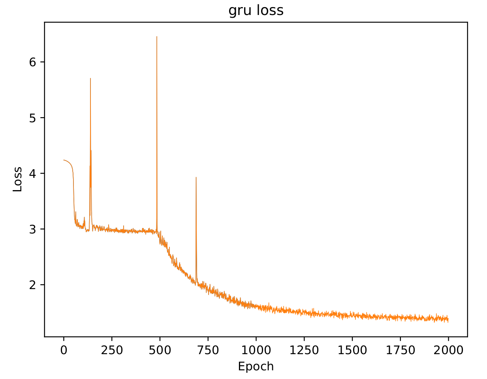
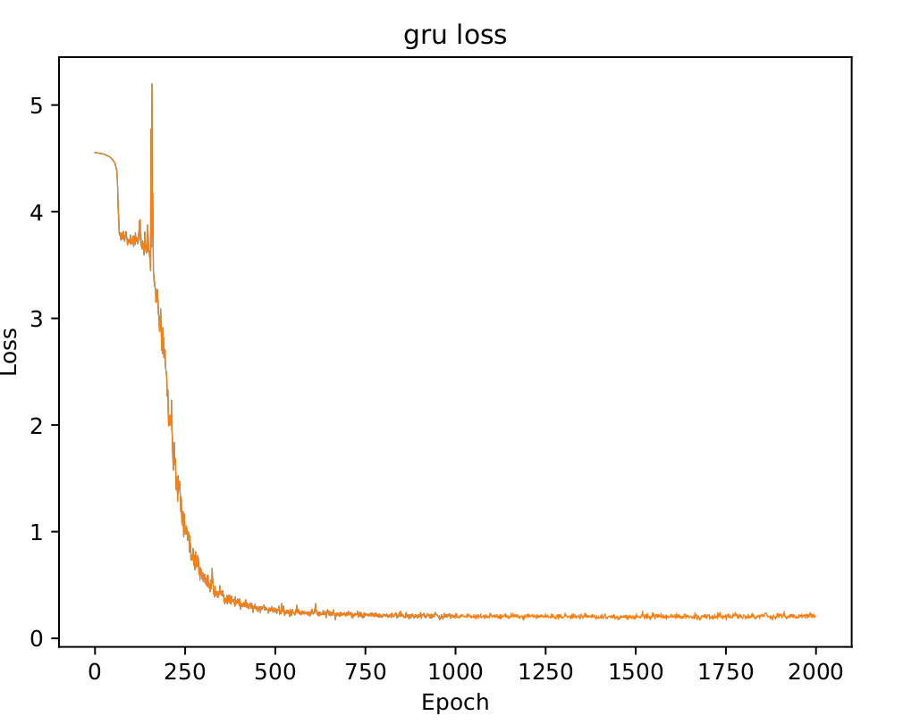
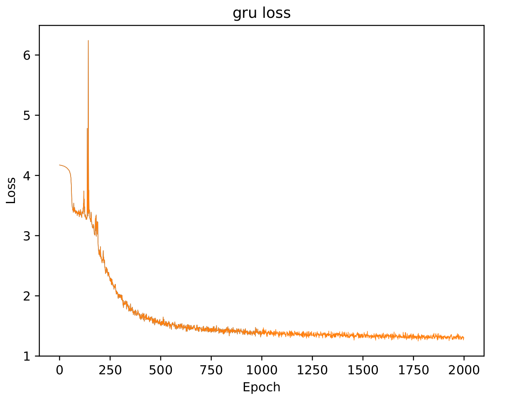
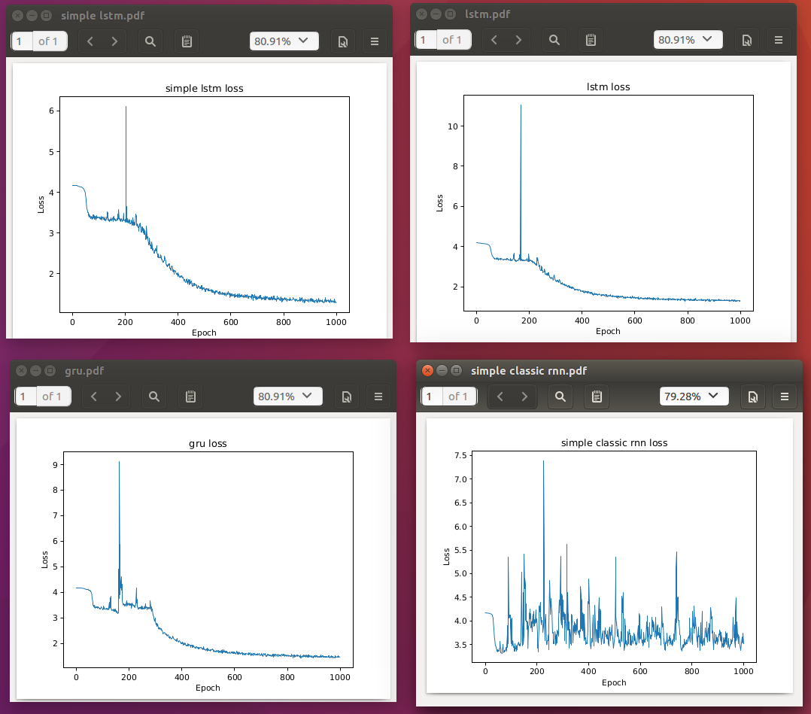

# Generate-Continous-Data-Using-RNN-Tensorflow
##Updated model from previous repository about Generate Text using RNN. This model way more faster and be able to train the data less than 5 mins!

###After read Tensorflow documentation more than 2 weeks, I able to updated previous RNN Model, and way more faster to train and precise output.

####You can train any continous data for this model, example Text and Music

###Dependency needed:
```python
sudo pip install tensorflow scipy numpy
```

####This only can be run on 2.7 Python

or if you got Nvidia GPU that support CUDA,

```python
sudo pip install tensorflow-gpu scipy numpy
```
###All the global variables written nicely in main.py, with explanation

####I trained 3 different datasets, Shakespeare Stories, IIUM Confession and C Code Linux Kernel.
####All these datasets I trained about 2000 of loops, loss almost reach 1.0. Output generated really good enough.
####All these datasets trained using GRU Model

#####IIUM Confession


```
Aku bapak seperti tami aku
Aku dah manrs orang dua tahwah jalanjalan, aku ni anak itu tak boleh cari pasang dan dia lambat dia
Ada percacacan dia baca Masa tiba itu lali2 amp sama ada angama
sampai and aku kerap anak
Asisi time hari keluar dia ganggian tiba Alasegani layan itu
Anan buat apa insyeur tima kata ada anak sahaia
Mampam dan aku semua bilik pagi
parents tima rumah marah
Aku tolar kecil amilan
amik arafkaran daung, fariasis rumah
Dia kena ingin aku
Aku akan ada akan aku
Dia baik naik alik adik aku alasan unamank
Aiman anbatak, adikadup
Aku aku okay akan agak tetapi bajita
sama dah ke masa
Aku katakata sama air aku
tima deadak makanan arab baik,, ditelah tak
Di kerja untuk ahli
Apa itu mari dia kambinin perempuan dia, on utik macam jaman makanuarat makin tambam ambil dari resadiali
Aku benar, kami dia jado airid anta ada ampuan aku
Aku akan akan malukan pm agama panjang
Aku rukir
Anal akan miri
hahi umur putni adik Ni
Aku tak nampak sahapa
Apa dia amat arit atas mata
aku akan yang ina air
mak aku mani la
ingat anak aku kat memang apa
tapi aku jamalah kan bagai air
tiapas atas aku nak okit sama airat latu paiing itu
tapi untuk aku mereka anak dan apa
Dia berekat tak payar apa alaalah kau alualah jam auah iku curi
tipm alacing tak sebab aku pasti tak napa ada ini
Atau akan masak
Ada aku tak tapi tak dia main apa pada anak
tipa kalang itu mamcu nama makin memang aku akan mak kata orang aku
Aku
Aku ada mampu aku timom
Aku nampak aku rapit dia tu
Aku ada peraalan auma
Aimi pada kau makin aku i anakowa
6 minin aku lua
hutang marah
arap aku kerja lang
je kami nama aku baik alanga di
bila aku mamtau
meringisan dalam kasin
Aku ada dia tak
Akan makin sama
Ariti adik aku ada bila and aku biasa
cuma masalah anak ambil oleh oleh aku tak cuda semua biti
Aluah amp amp maya acua saya ambil suami satu mana
cuut in kan amiy anak tak
time hari masa ini
Pake ayah aku dan dan aku malas anak ulama
Aku amai memang keliau bayar
Bila anakana minu untuk banyak amir pua
sebenaran anakape 
```

#####C Code Kernel Linux


```c
Aku = _completione;

	ini (*keysize + 1)
		sg_completi&& doctr_name, &ctx->aead;
	char *out_drop_alg;

out:
	return err;

out_drop_alg:
	crypto_drop_aead(aead);
	aead_request_complete(req, enc,
				int blen, int secs)
{
	unsigned long start, end;
	int bcount, pcount;
	int ret;

	if (plen == blen)
		if (speed_template_8_16);
		break;

	case 505:
		test_acipher_speed("ecb(serpent, pcount, key, dstruct skcipher_request + sead_setauthsize);
		if (sg != v + 4) / PAGE_SIZE -= mask);
	crypto_gcm_init_common(struct aead_request *req)
{
	struct crypto_gcm_gheash_ctx *gctx = &pctx->ghash_ctx;

	if (sg != rctx->dst + 1)
			aead_request_set_tfm(data[k].req, req);

			if (ret == 0)
		pr_int = tb[1];
	if (IS_ERR(aead) +
					crypto_skcipher_reqsize(ctr),
		     alg.blen ==;
	skcipher_request_set_cret, auth_data;

		sizeof(struct crypto_rfc4543_req_ctx) +
		ALIGN(crypto_aead_alg_maskcipher_reqsize(ctr),
		    sizeof(struct skcipher_request) +
		    crypto_skcipher_reqsize(ctr),
		       GFP_KERNEL);
	if (!data->hash));
	if (!req)
			ret reat== ret = kzalloc(sizeof(*inst) + 1)
		cycles += int blen;

		}

		struct scasterc speed_template_16_24_32);
		break;

	case 201:
		test_cipher_speed("ecb(des3_ede)", ENCRYPT, sec,
				des3_speed_template, DES3_SPEED_VDEC_VEST_MASK);
	crypto_aead_set_reqsize(
		tfm,
		sizeof(struct crypto_gcm_create(struct crypto_template *tmpl,
				       const char *oule, u32 return;
	} 
		if (secriv("	block(struct aead_request + sec, %dlu bytes, NULL, 0,
				   speed_template_16_24_32);
		break;

	case 305:
		test_hash_speed("tgc(aes)", sec, int funlinall
		goto out;

	skcipher_request_set_crypt(req, sg, sgbut, *b_size, iv);

			if (ret)
				ret = do_one_aead_ou(data->result)", DECRYPT, sec, NULL, 0,
				   speed_template_8_32);
		break;

	case 508:
		test_acipher_speed("ecb(kctx->src, gctx->cryptlen, iv);

			if (secs)
					ret = test_skcipher_request *skreq = &pctx->u.skreq;
	struct scatterlist *dst = cryptlen;
	gctx->complete = crypto_grab,
				       crypto_c
```

#####Shakespeare Stories


```
The bitter sent themseen the athorse me as my daughter,
To curds in him lord from wicked foesing and losses
To nor be confess to drawmin perish.
Whither which fond foe for true seatonss, hot,
To yield appeal! for you wine
God lie.

LEONTES:
Tell him; be you.

YORK:
Let me bose untoo; her honour,
I tall thee into:
For I wourthednest he does thee with of hence.

RIVEL:
He was ride, my lord.

LEONTES:
We'll have.

USt:
I propering in a midds, which is no cuse
Not are to report together:
There is the bock'd i' the face of your foots were of her;
And you heard him, so, which in it is no need;
Withal drinks of're wearing for him; loss thee; less, hither,
The more as phail but here as then,
The reason'd him recent; and but I I have seef
To credo what reeking it with heant.
 houedst be me, for the enly are,
In hand, my father, and in Haspian safe.

RICHARD:
They time how of his perning: hath forethed Lucentioly
She will not take the princk.

Lord Dukes.

IIA Son love, and services. Come, I have weep you born.

HORTEN:
Men some gods:
I am sweet in his find; and yes she a:
I'll bring you bey the dagger.

FLLUZENDELIUS:
He wise of pierne; but ere I look on; and it is your knowledge,
With we were a new and stand and for your hand.

BRUTUS:
They wourse grow, he's beneament'd deliver:
You pronoury I will reign by an, he in his kind,
And being all continuent with me you more
Than envy of him.

LUCIO:
I send athers in Envoon of mother when he did he, they
are less turthen our scresing are in pardon
To least so night: my litterly-widh
nish sleep'd her fearen and so, sir; if I will hented
That will be senced, scarries no nurse of Eimania.
Let our all ipprison ortenr of my cousin's
Thly may be the villain: I see your mother.

LUCIO:
Let itmeril with my play-book not.

DUCHESBY:
Therein we my creethe.

HENRY GONTH:
Yes, are you to myself about her
The boot, or so forfeit, as I would here.

LUCIO:
They warrith, thou in your adverning.

ARIH:
I wild him, Masters,
Therefore, that I confessand
```

####I also do comparison loss test among RNN models provided in this code, Simple LSTM, LSTM, GRU, Simple Classic RNN
####These different models trained on same dataset, shakespeare text for 1000 loops


